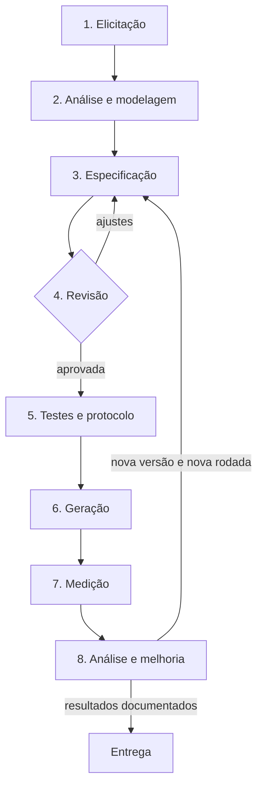

# Entregável 1 — Processo de análise e especificação de requisitos

**Versão:** 1.1 · **Disciplina:** Sistemas Distribuídos — PUC · **Data:** 2026-09-19

> Revisão posterior ao experimento. A [versão 1.0](../experimento/historico/v1/entregaveis/01-processo.md) foi preservada. As medições do [relatório](04-relatorio-tecnico.md) avaliam as especificações históricas baseadas no template 1.0; não demonstram o desempenho da revisão 1.1.

## 1. Objetivo e princípios

Transformar uma necessidade em uma especificação Markdown reutilizável por uma LLM, gerar software e medir sua conformidade. A meta da atividade é atingir pelo menos 85% dos critérios de aceitação definidos. A especificação reduz decisões implícitas, mas não garante que uma LLM implemente corretamente todos os requisitos.

O processo é aplicável a diferentes sistemas. Contratos HTTP são usados nos exemplos desta atividade; sistemas de linha de comando, interfaces gráficas e outros serviços devem descrever suas próprias entradas, ações e saídas observáveis.

Princípios:

1. Definir requisitos verificáveis e vinculados a necessidades reais.
2. Derivar os testes da especificação e congelar o instrumento antes da geração.
3. Preservar código, entradas e resultados de cada execução, sem correções manuais no objeto medido.
4. Separar resultado observado de inferência sobre outras gerações, sistemas ou modelos.
5. Registrar desvios do protocolo e informações desconhecidas, sem completar o histórico por suposição.
6. Versionar melhorias e avaliá-las em novas rodadas antes de alegar ganho de conformidade.

## 2. Fluxo e responsabilidades

O analista responde pelas etapas 1–3; um revisor diferente do autor responde pela etapa 4; o responsável pelos testes responde pela etapa 5; o operador responde pelas etapas 6–7; a equipe analisa os resultados na etapa 8. Papéis podem se acumular, exceto a revisão independente. Quando não houver revisor independente, registrar a revisão como pendente ou autoverificação, nunca como revisão por pares concluída.

## 3. Etapas do processo

### 1 — Elicitação

- **Objetivo:** compreender problema, beneficiários e necessidades.
- **Entradas:** demanda, relatos dos interessados e restrições conhecidas.
- **Atividades:** entrevista real ou simulada identificada como tal; levantamento de atores, funcionalidades, prioridades e limitações.
- **Saídas:** objetivo do sistema, atores e lista de necessidades com sua origem.
- **Critério de saída:** objetivo compreensível e cada necessidade associada a uma fonte; dúvidas relevantes registradas para resolução.

### 2 — Análise e modelagem

- **Objetivo:** organizar e delimitar as necessidades.
- **Entradas:** levantamento da etapa 1.
- **Atividades:** identificar entidades, estados, regras de negócio, requisitos funcionais e não funcionais; resolver conflitos; definir o escopo incluído e excluído.
- **Saídas:** modelo de dados, regras identificadas e escopo justificado.
- **Critério de saída:** toda necessidade classificada ou excluída com justificativa; nenhuma ambiguidade que impeça a especificação permanece sem tratamento.

### 3 — Especificação

- **Objetivo:** preencher o [modelo de requisitos](02-modelo-requisitos.md), seguindo as [instruções](03-instrucoes-preenchimento.md).
- **Entradas:** análise, modelo e instruções na versão escolhida.
- **Atividades:** definir IDs, contratos, validações, erros, precedência, restrições técnicas e critérios Dado/Quando/Então; iniciar a rastreabilidade.
- **Saídas:** documento versionado, sem campos obrigatórios pendentes.
- **Critério de saída:** comportamentos observáveis definidos, termos consistentes e restrições compatíveis com o ambiente disponível.

### 4 — Revisão e validação documental

- **Objetivo:** detectar omissões e contradições antes da geração.
- **Entradas:** documento e checklist das instruções.
- **Atividades:** revisão por pessoa distinta do autor; confrontar documento com necessidades; avaliar clareza, consistência, verificabilidade e rastreabilidade.
- **Saídas:** parecer com responsável, data, evidências e itens aprovados, reprovados ou não aplicáveis com justificativa.
- **Critério de saída:** todos os itens aplicáveis aprovados. Pendências retornam à etapa 3.

A norma [ISO/IEC/IEEE 29148:2018](https://www.iso.org/standard/72089.html) é uma referência sobre processos e informações de engenharia de requisitos. O checklist desta atividade é uma adaptação didática; não constitui auditoria de conformidade integral com a norma.

### 5 — Instrumento de medição e protocolo

- **Objetivo:** definir como a conformidade será medida antes de conhecer as saídas da LLM.
- **Entradas:** documento revisado e ambiente de execução.
- **Atividades:** transformar cada CA em um teste; definir inspeções de RNF; verificar rastreabilidade; fixar fórmula, denominador, ponto de entrada, tempos limite e regras para falhas. Definir hipótese, amostragem e pressupostos estatísticos antes da coleta.
- **Saídas:** testes, matriz, protocolo, versões do ambiente e hashes das entradas.
- **Critério de saída:** cada CA possui exatamente um teste neste protocolo, cada teste corresponde a um CA e cada RNF possui método próprio. Testes devem verificar todas as condições observáveis do CA; correspondência de IDs sozinha não prova suficiência.

Uma implementação de referência pode auxiliar a depuração do instrumento. Seus resultados são separados das gerações experimentais e não provam ausência de toda contradição no documento. Referências e testes não devem entrar no contexto da geração.

### 6 — Geração controlada

- **Objetivo:** obter implementações a partir das entradas congeladas.
- **Entradas:** especificação, prompt, modelo e plano de execuções.
- **Atividades:** iniciar sessão independente por geração; fornecer apenas o prompt e a especificação; preservar a saída sem correções ou continuação. O texto fixo do prompt permanece igual; os campos de diretório e especificação variam conforme o grupo.
- **Saídas:** código original, prompt materializado e registro de execução.
- **Critério de saída:** registrar modelo exato quando disponível, alias, parâmetros, data/hora da geração, identificação da sessão e hashes. Informações indisponíveis ficam explicitamente desconhecidas.

Se o modelo ou o prompt mudar, iniciar nova rodada identificada. Não juntar condições diferentes como se fossem repetições do mesmo tratamento.

### 7 — Verificação

- **Objetivo:** medir o produto sem modificá-lo.
- **Entradas:** código preservado, instrumento e ambiente.
- **Atividades:** conferir ambiente e integridade, iniciar aplicação, executar testes e inspeções, guardar logs e resultados por critério.
- **Saídas:** taxa por execução, resultados de RNF, diagnóstico, data da medição e manifesto de integridade.
- **Critério de saída:** todos os critérios contabilizados e falhas de infraestrutura resolvidas ou identificadas como medições inválidas.

No protocolo histórico desta AED, ponto de entrada ausente, falha da aplicação e timeout da suíte resultam em zero para os CAs dependentes. Erros do ambiente ou do instrumento, como porta bloqueada ou falha de coleta dos testes, invalidam a medição: não são evidência de não conformidade do produto. Uma reavaliação é registrada separadamente, nunca sobrescreve a observação anterior.

### 8 — Análise e melhoria

- **Objetivo:** interpretar resultados e melhorar o processo.
- **Entradas:** medidas válidas, logs, documentos e metadados.
- **Atividades:** calcular estatísticas; confrontar a hipótese com seus pressupostos; classificar falhas; discutir limitações e revisar artefatos quando necessário.
- **Saídas:** relatório técnico e propostas ou novas versões documentais.
- **Critério de saída:** achados sustentados por evidências, causas desconhecidas reconhecidas, revisões identificadas e conclusão compatível com o que foi medido.

Classificar problemas como ambiguidade da especificação, lacuna do modelo, desvio da geração, incompatibilidade do protocolo ou falha do instrumento/ambiente. As causas podem coexistir; não atribuir automaticamente toda falha à LLM ou ao documento.

## 4. Métricas e critério de sucesso

`Conformidade funcional (%) = 100 × CAs atendidos / CAs definidos`

Cada CA é binário. Na biblioteca há 40 CAs por execução; não se altera o denominador conforme os testes que conseguem executar. Os cinco RNFs são reportados separadamente, com distinção entre inspecionados, testados e não observados. A taxa funcional não equivale à verificação exaustiva de todo o documento.

A unidade amostral para estatística é a geração: dez implementações constituem dez observações, e não 400 observações independentes. Atingir ≥85% na amostra atende à meta observacional da atividade. Uma conclusão sobre a média populacional exige teste aplicável e pressupostos sustentáveis. Variância amostral zero não permite rejeitar a hipótese nula automaticamente.

## 5. Versionamento e entrega

Entregar processo, modelo reutilizável, instruções e relatório com evidências. Preservar versões anteriores e identificar qual versão foi efetivamente avaliada. A revisão 1.1 corrige a separação entre evidência e prescrição, os critérios de revisão, o registro de infraestrutura e a interpretação estatística; não houve nova geração de software para avaliá-la.
