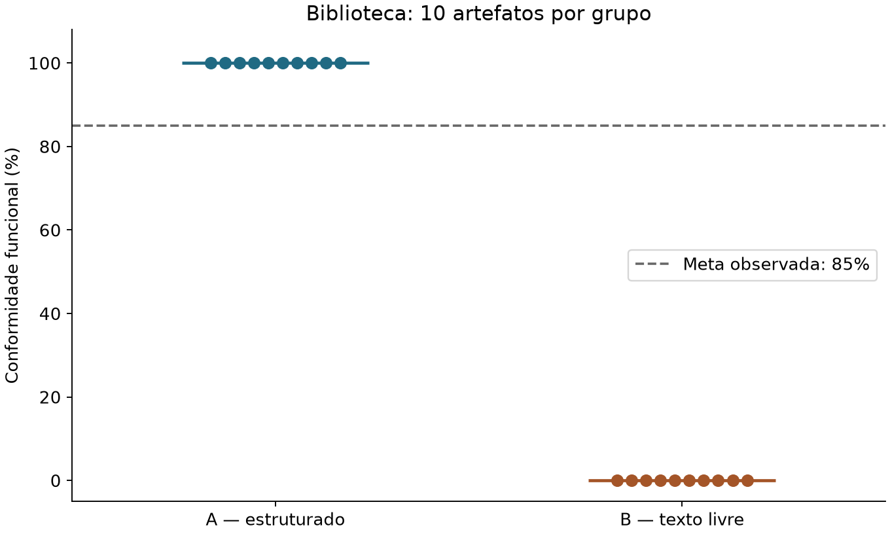
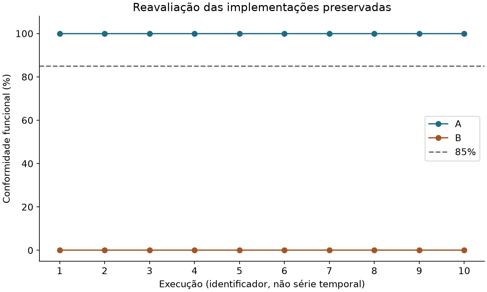

# Entregável 4 — Relatório técnico do experimento

**Título:** Especificação estruturada em Markdown para geração de uma API de biblioteca por LLM  
**Disciplina:** Sistemas Distribuídos — PUC  
**Data:** 19 de setembro de 2026  
**Versão do relatório:** 1.0 · **Template avaliado:** 1.0 · **Revisão documental entregue:** 1.1

## Resumo

Esta atividade desenvolveu um processo de análise de requisitos, um modelo de documento Markdown e instruções de preenchimento, com meta de conformidade funcional de pelo menos 85% no software gerado por uma LLM. Foram recuperadas 20 implementações existentes de uma API de biblioteca, identificadas nos registros com o alias de modelo `sonnet`: dez associadas a uma especificação estruturada e dez a uma descrição livre. A reavaliação preservou os códigos e aplicou a suíte histórica de 40 critérios de aceitação por implementação.

As dez implementações do grupo estruturado atenderam a **40/40 critérios (100%)**. As dez do grupo de texto livre receberam **0/40 pelo protocolo**, pois não possuíam o ponto de entrada `app/main.py`, condição não fornecida no texto livre. A meta observada foi superada no grupo estruturado. A comparação não isola o efeito do formato Markdown, e a hipótese sobre a média populacional permanece inconclusiva pelo teste t planejado, devido à variância amostral nula. Uma análise binomial exploratória é apresentada com hipótese distinta e limitações explícitas. A reavaliação confirmou os resultados anteriores e a integridade de 219 arquivos protegidos.

## 1. Problema e objetivo

O [enunciado](../descricao-aed.md) pede um processo de análise, um artefato reutilizável em Markdown, instruções e um experimento científico que demonstre conformidade ≥85%. O produto avaliado nesta atividade é o processo e seu artefato; a API é o objeto utilizado para testá-los.

A pergunta investigada é: **o documento produzido pelo processo permite obter implementações que atendam a pelo menos 85% dos critérios especificados?** A observação em um caso não basta para afirmar que o modelo terá o mesmo desempenho em todo sistema ou LLM.

## 2. Fundamentação e artefatos

A engenharia de requisitos organiza a identificação, documentação e verificação das necessidades do sistema. A ISO/IEC/IEEE 29148:2018 aborda processos e informações de requisitos ao longo do ciclo de vida. Nesta atividade, ela é referência de contexto; não houve auditoria de conformidade integral com a norma. [ISO](https://www.iso.org/standard/72089.html)

Os critérios usam Dado/Quando/Então para explicitar contexto, ação e resultado, seguindo a organização de cenários documentada pelo Gherkin. A execução aqui usa funções Python com `pytest`, e não um interpretador de arquivos Gherkin. [Cucumber](https://cucumber.io/docs/gherkin/reference/)

A especificação estruturada fixa escopo, dados, regras de negócio, contratos, erros, tecnologia e inicialização. A hipótese prática é que explicitar essas decisões reduza divergências entre o comportamento desejado e a saída da LLM. Esse mecanismo é uma motivação do desenho, não uma causalidade comprovada pelos resultados disponíveis.

Os três primeiros entregáveis foram revisados para a versão 1.1: [processo](01-processo.md), [modelo](02-modelo-requisitos.md) e [instruções](03-instrucoes-preenchimento.md). As [versões 1.0](../experimento/historico/v1/entregaveis/) foram arquivadas. **Os resultados deste relatório não avaliam a versão 1.1.**

## 3. Hipóteses e decisões analíticas

### 3.1 Meta observacional e hipótese principal

A meta da atividade é `C ≥ 85%`, em que `C` é a conformidade funcional medida. O protocolo analítico histórico propôs, adicionalmente:

- **H₀:** μ ≤ 85%, em que μ é a média populacional das taxas de novas gerações nas mesmas condições.
- **H₁:** μ > 85%.
- **Nível de significância:** α = 0,05; teste t unilateral de uma amostra.

O teste t usa a diferença entre a média amostral e o valor de referência dividida pelo erro padrão. Com desvio-padrão zero, a implementação revisada não reporta estatística t, p-valor ou intervalo t degenerado como evidência de certeza. Registra o teste como **inconclusivo**. Não se substitui automaticamente esse teste por outro com hipótese diferente. [SciPy — teste t](https://docs.scipy.org/doc/scipy/reference/generated/scipy.stats.ttest_1samp.html)

### 3.2 Análise exploratória posterior à coleta

Como complemento, definiu-se `q = P(C > 85%)`, isto é, a probabilidade de uma geração superar o limiar. Testa-se **H₀: q ≤ 0,5** contra **H₁: q > 0,5**, usando teste binomial exato unilateral, α = 0,05. Taxas exatamente iguais a 85% não são sucessos nesta análise, embora atendam à meta observacional.

Essa análise é **pós-hoc**, não foi pré-registrada e exige gerações independentes com a mesma probabilidade de sucesso. Não testa μ > 85%, nem q > 85%. Calcula-se também um intervalo exato bilateral de 95% para q. [SciPy — teste binomial](https://docs.scipy.org/doc/scipy/reference/generated/scipy.stats.binomtest.html)

## 4. Método

### 4.1 Objeto e desenho disponível

A API de biblioteca contempla livros, usuários, empréstimos, devoluções e pagamento de multas. O documento histórico contém 10 requisitos funcionais, 40 critérios de aceitação e cinco requisitos não funcionais.

| Grupo | Entrada | Artefatos de geração | Modelo registrado | Situação |
|---|---|---:|---|---|
| A | Documento estruturado da biblioteca, v1.0 | 10 | `sonnet` | Reavaliado |
| B | Texto livre sobre biblioteca | 10 | `sonnet` | Reavaliado |
| C | Documento estruturado de estoque | 0 | `sonnet`, previsto | Não realizado |
| D | Documento estruturado da biblioteca | 0 | `haiku`, previsto | Não realizado |

C e D possuem preparativos, mas não geraram observações. Referência e pilotos de biblioteca são artefatos de apoio, excluídos da amostra. Não houve nova geração por LLM nesta revisão.

A variável de tratamento pretendida era o documento de entrada. Entretanto, A e B diferem simultaneamente na organização, no detalhamento dos contratos e nas restrições técnicas. O texto livre pede Python e uma API, mas não exige FastAPI nem `app.main:app`; todos os códigos B importam Flask. Por isso, a comparação é descritiva e não identifica o efeito isolado da estrutura Markdown.

### 4.2 Procedência e controles

O [prompt padrão](../experimento/prompt-padrao.md) prevê geração em turno único, sem acesso ao repositório e sem testes escritos pela própria geração. Há prompts materializados por execução e códigos diferentes em cada uma das dez pastas de cada grupo. Isso permite inspecionar entradas e artefatos, mas não comprova a independência das sessões.

O histórico registra somente o alias `sonnet`, sem versão exata, temperatura, seed, identificadores de sessão, respostas brutas ou horários individuais da geração. As datas do CSV são **datas de medição**, não de geração. Não há evidência suficiente para comprovar revisão humana independente ou que todos os testes foram escritos antes das gerações, apesar de comentários históricos declararem esse procedimento.

### 4.3 Ambiente reproduzido

As versões instaladas coincidem com [requirements.txt](../requirements.txt):

| Componente | Versão |
|---|---|
| Python | 3.14.4 |
| FastAPI / Uvicorn | 0.141.1 / 0.53.0 |
| Pydantic / HTTPX | 2.13.5 / 0.28.1 |
| pytest | 9.1.1 |
| NumPy / SciPy | 2.5.3 / 1.18.1 |
| pandas / Matplotlib | 3.0.6 / 3.11.2 |

O [manifesto do ambiente](../experimento/reavaliacoes/validacao-2026-09-19/ambiente.json) registra sistema, interpretador, versões e hashes dos instrumentos utilizados. As chamadas HTTP ocorreram em loopback, com uma aplicação por medição. Um ensaio inicial no sandbox encontrou bloqueio de porta e foi corretamente classificado como medição inválida; a reavaliação válida ocorreu com permissão de acesso à porta local. Esse ensaio não constitui nova observação da amostra.

### 4.4 Instrumento e fórmula

`C = 100 × (número de CAs aprovados / 40)`

Cada CA tem exatamente um teste identificado. Os dois testes HTTP de RNF e as três inspeções estruturais são reportados separadamente. A unidade amostral é a implementação gerada: há **n = 10 por grupo**, não 400 observações estatisticamente independentes.

O protocolo histórico procura `app/main.py` e inicia `uvicorn app.main:app`; admite uma pasta intermediária. A ausência desse arquivo, falha da aplicação ou timeout da suíte implica zero nos CAs dependentes. Os limites são 30 segundos para inicialização e 600 segundos para a suíte. Falhas do ambiente ou do instrumento invalidam a medição e não são tratadas como nota do produto.

Os [26 testes de regressão do instrumento](../experimento/reavaliacoes/validacao-2026-09-19/testes-instrumento.xml) passaram. Eles cobrem duplicidades, falha da aplicação, bloqueio de porta, timeout, coleta inválida, JUnit incompleto, módulos locais e casos estatísticos constantes, insuficientes ou inválidos.

A revisão do medidor preservou as regras de pontuação e acrescentou diagnóstico de infraestrutura, rejeição de resultados JUnit incompletos/duplicados, logs e supressão de escrita de bytecode no código avaliado. A inspeção passou a distinguir módulos locais de dependências externas. Nenhum teste histórico de conformidade foi alterado.

### 4.5 Procedimento da reavaliação

1. Arquivar 11 documentos/scripts anteriores e registrar hashes de 219 arquivos protegidos, incluindo códigos, especificações, prompts, testes e resultados históricos.
2. Conferir a rastreabilidade: biblioteca, 40 CAs/40 testes; estoque, 23 CAs/23 testes, apenas verificação estática.
3. Validar correções do instrumento com sua suíte própria, separada da suíte experimental.
4. Reexecutar as medições sobre as 20 implementações existentes, sem adaptação do grupo B.
5. Guardar CSV, JSON por execução, logs de servidor/pytest e JUnit em pasta nova.
6. Comparar resultados com os históricos e verificar novamente os hashes.
7. Calcular estatísticas, produzir gráficos e interpretar os limites da evidência.

A reavaliação ocorreu em **2026-09-19, de 23:27:11 a 23:27:33 UTC** (20:27:11–20:27:33 em São Paulo). Reavaliar o mesmo código verifica reprodução da medida; não aumenta o número de gerações.

## 5. Resultados

### 5.1 Resultados individuais

| Grupo | Execução | Aplicação iniciou pelo protocolo | CAs aprovados | Conformidade |
|---|---|---|---:|---:|
| A | run-01 | Sim | 40/40 | 100% |
| A | run-02 | Sim | 40/40 | 100% |
| A | run-03 | Sim | 40/40 | 100% |
| A | run-04 | Sim | 40/40 | 100% |
| A | run-05 | Sim | 40/40 | 100% |
| A | run-06 | Sim | 40/40 | 100% |
| A | run-07 | Sim | 40/40 | 100% |
| A | run-08 | Sim | 40/40 | 100% |
| A | run-09 | Sim | 40/40 | 100% |
| A | run-10 | Sim | 40/40 | 100% |
| B | run-01 | Não — ponto de entrada ausente | 0/40 | 0% |
| B | run-02 | Não — ponto de entrada ausente | 0/40 | 0% |
| B | run-03 | Não — ponto de entrada ausente | 0/40 | 0% |
| B | run-04 | Não — ponto de entrada ausente | 0/40 | 0% |
| B | run-05 | Não — ponto de entrada ausente | 0/40 | 0% |
| B | run-06 | Não — ponto de entrada ausente | 0/40 | 0% |
| B | run-07 | Não — ponto de entrada ausente | 0/40 | 0% |
| B | run-08 | Não — ponto de entrada ausente | 0/40 | 0% |
| B | run-09 | Não — ponto de entrada ausente | 0/40 | 0% |
| B | run-10 | Não — ponto de entrada ausente | 0/40 | 0% |

Fonte: [CSV da reavaliação](../experimento/reavaliacoes/validacao-2026-09-19/bruto.csv) e [JSON por execução](../experimento/reavaliacoes/validacao-2026-09-19/execucoes/). Em B, os CAs foram reprovados por dependência do início da aplicação; não foram executados individualmente via HTTP.

### 5.2 Estatísticas descritivas

| Grupo | n | Média | Desvio-padrão amostral | Mediana | Mínimo–máximo | Execuções ≥85% |
|---|---:|---:|---:|---:|---|---:|
| A | 10 | 100% | 0 pp | 100% | 100%–100% | 10/10 |
| B | 10 | 0% | 0 pp | 0% | 0%–0% | 0/10 |

A diferença observada é **100 pontos percentuais**. Não se apresenta teste causal A/B ou tamanho de efeito padronizado: as entradas não possuem contrato de execução equivalente e o desvio dentro dos grupos é zero. Não se usa um intervalo `[100%; 100%]` como garantia sobre futuras gerações.

Cada ponto representa uma implementação; o deslocamento horizontal apenas permite visualizar observações coincidentes. A linha tracejada indica a meta de 85%. Os zeros em B têm a causa de protocolo descrita acima.

Os números das execuções são identificadores, não evidência da ordem temporal de geração. Gráficos e estatísticas são produzidos por [estatistica.py](../experimento/estatistica.py).

### 5.3 Requisitos não funcionais

| RNF | Instrumento | A | B sob as restrições do documento estruturado |
|---|---|---:|---|
| RNF-01 — árvore de arquivos | Inspeção de arquivos | 10/10 aprovados | 0/10 compatíveis |
| RNF-02 — entrada `app.main:app` | Inspeção estática | 10/10 aprovados | 0/10 compatíveis |
| RNF-03 — dependências | Inspeção de imports | 10/10 aprovados | 0/10 compatíveis; Flask nas dez |
| RNF-04 — formato global de erro | Teste HTTP amostral | 10/10 aprovados | Não observado |
| RNF-05 — consulta em até 500 ms | Teste HTTP local | 10/10 aprovados | Não observado |

Os RNFs estruturais de A não foram exigidos com a mesma precisão no texto livre. Portanto, B incompatível com essas restrições não equivale a descumprimento demonstrado de seu próprio pedido. O resultado está nos campos `inspecao` e `rnf` dos JSON. O campo `rnf_total` do CSV cobre somente os testes HTTP efetivamente executados, não os cinco RNFs.

### 5.4 Hipóteses

Para A, média = 100%, desvio = 0 e n = 10. O teste t planejado sobre μ foi registrado como **inconclusivo**; a rejeição determinística de H₀ feita pelo script anterior foi removida.

Na análise binomial exploratória, k = 10 sucessos em n = 10, com **p = 0,0009765625** para H₀: q ≤ 0,5. O intervalo exato bilateral de 95% para q é **[0,6915; 1]**. Sob independência e condições equivalentes, esse cálculo rejeitaria sua hipótese nula específica a 5%. Entretanto, os registros não comprovam independência das gerações, e a análise foi escolhida depois de conhecidos os resultados. Ela não confirma a hipótese original sobre μ nem estabelece probabilidade de sucesso superior a 85%.

Os valores completos estão em [estatisticas.json](../experimento/reavaliacoes/validacao-2026-09-19/estatisticas.json).

### 5.5 Integridade e reprodução

A [auditoria](../experimento/reavaliacoes/validacao-2026-09-19/auditoria.json) comparou os 20 resultados com os históricos: **zero divergências** nos critérios, taxas e testes HTTP de RNF. Também confirmou os hashes dos **219 arquivos protegidos** e dos **11 arquivos arquivados**, sem alteração. Isso comprova integridade desde o início desta revisão, não a procedência das gerações anteriores.

## 6. Discussão e ameaças à validade

**Validade interna.** O controle está confundido com tecnologia, ponto de entrada e precisão contratual. A falha de inicialização impede distinguir quantos comportamentos de negócio B implementa corretamente. Não é possível concluir que Markdown sozinho causou a diferença.

**Validade de construto.** A métrica avalia os 40 CAs pela suíte disponível, não todos os estados possíveis nem todas as frases da especificação. A inspeção encontrou limites concretos: o filtro de livros usa `all(...)`, que também aceita lista vazia; o teste de soma de multa parte de saldo zero; o teste de quitação confere a resposta, sem nova consulta de persistência; RNF-04 verifica quatro situações de erro. RNF-05 faz 200 tentativas de cadastro sem verificar cada resposta e mede uma única consulta; não comprova distribuição de latência nem carga exata. Os testes permaneceram preservados e esses limites foram documentados, sem ajustar a pontuação retroativamente.

**Validade estatística.** Há somente dez gerações por condição, taxas limitadas a 0–100%, efeito de teto em A e piso em B, além de variância nula. Os 40 testes de uma implementação compartilham código e estado; tratá-los como 40 amostras independentes inflaria artificialmente a evidência. A independência entre sessões também não foi demonstrada.

**Validade externa.** O resultado se restringe a uma API pequena, com armazenamento em memória, um caso de domínio e um alias de modelo. Não há experimento de estoque nem comparação com Haiku concluídos. Não se infere desempenho em sistemas distribuídos em produção, persistência, autenticação, concorrência ou outros modelos.

**Procedência e cronologia.** Faltam identificação exata do modelo, parâmetros, logs de geração e revisão humana identificada. O modelo 1.0 exigia procedimentos cuja execução não está comprovada. Os checklists anteriores afirmavam uma referência de estoque aprovada, mas ela não foi encontrada. Essas alegações foram substituídas por registros de evidências disponíveis.

## 7. Melhorias realizadas e trabalhos futuros

Nesta revisão foram corrigidos o tratamento da variância zero, a identificação de erros do ambiente, a detecção de duplicidades, o reconhecimento de módulos locais e a preservação de logs e versões. Processo, template e instruções 1.1 agora distinguem versão especificada de ambiente instalado, seção não aplicável de omissão, revisão prevista de revisão comprovada e sucesso observado de generalização estatística.

Para uma **nova rodada**, recomenda-se fornecer contrato técnico comum aos grupos e variar apenas a organização da especificação, registrar sessões e modelo exato, realizar revisão independente antes da coleta, reforçar os testes identificados e definir previamente a análise estatística. Estoque e o segundo modelo permanecem propostas de ampliação. Essas melhorias não receberam nova avaliação de geração nesta entrega; não se alega aumento medido de conformidade entre versões.

## 8. Conclusão

O documento estruturado histórico está associado a dez implementações que obtiveram **100% de conformidade nos 40 critérios medidos**, superando a meta observacional de 85%. As medições foram reproduzidas sem alterar os artefatos avaliados. Assim, a entrega demonstra o resultado solicitado para o caso de biblioteca e disponibiliza os quatro artefatos e suas evidências.

A evidência não demonstra causalidade isolada do formato Markdown nem comprova média populacional superior a 85% pelo teste t planejado. O relato dessas limitações integra a aplicação do método científico e delimita o que se pode concluir dos dados disponíveis.

## 9. Referências e apêndices

Referências consultadas em 19/09/2026:

1. [ISO/IEC/IEEE 29148:2018 — Requirements engineering](https://www.iso.org/standard/72089.html). Descrição pública da norma; o texto integral não foi usado para certificar o processo.
2. [Cucumber — Gherkin Reference](https://cucumber.io/docs/gherkin/reference/). Organização de cenários.
3. [SciPy — `ttest_1samp`](https://docs.scipy.org/doc/scipy/reference/generated/scipy.stats.ttest_1samp.html). Teste para média de uma amostra.
4. [SciPy — `binomtest`](https://docs.scipy.org/doc/scipy/reference/generated/scipy.stats.binomtest.html). Teste binomial e intervalo exato para proporção.

Apêndices disponíveis no repositório:

- **A — Entradas:** [especificação da biblioteca](../casos/biblioteca/requisitos-biblioteca.md), [texto livre](../casos/biblioteca/descricao-livre.md), [prompt](../experimento/prompt-padrao.md) e [prompts materializados](../experimento/resultados/prompts/).
- **B — Implementações e instrumento original:** [códigos históricos](../experimento/resultados/execucoes/), [suíte da biblioteca](../casos/biblioteca/testes/) e [instrumentos v1 arquivados](../experimento/historico/v1/experimento/).
- **C — Evidências:** [resultados históricos](../experimento/resultados/bruto.csv), [reavaliação](../experimento/reavaliacoes/validacao-2026-09-19/), [logs](../experimento/reavaliacoes/validacao-2026-09-19/logs/) e [manifesto inicial](../experimento/historico/v1/manifesto.json).
- **D — Reprodução:** [README](../README.md), [testes do instrumento](../experimento/testes/) e [checagem de integridade](../experimento/auditar.py).
