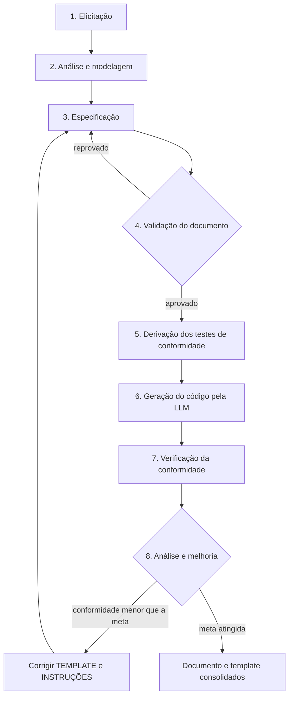

# Entregável 1 — Processo de Análise e Especificação de Requisitos para Geração de Código por LLM

**Versão do processo:** 1.0
**Disciplina:** Sistemas Distribuídos — PUC
**Data:** 2026-09-19

---

## 1. Propósito

Este documento define o processo que leva uma equipe **de uma ideia de sistema até um documento de requisitos capaz de fazer uma LLM gerar código com conformidade verificada ≥ 85%**, e daí até a medição dessa conformidade.

O processo parte de uma constatação prática: uma LLM não erra por incapacidade de programar, erra por **preencher lacunas**. Tudo que o documento não fixa — o nome de um campo, um código HTTP, o texto de uma mensagem de erro, a biblioteca de persistência — a LLM decide sozinha, e cada decisão dessas é um desvio potencial em relação ao que se queria. O processo existe para reduzir sistematicamente o número de lacunas antes de a LLM ser acionada, e para **medir** o resultado em vez de opinar sobre ele.

## 2. Princípios que sustentam o processo

| # | Princípio | Consequência prática |
|---|---|---|
| P1 | **O que não está escrito será inventado** | Toda ambiguidade é tratada como defeito do documento, não como erro da LLM. |
| P2 | **O critério de aceitação é a unidade de medida** | Conformidade é contada por critério de aceitação (binário), não por requisito ou por "impressão de qualidade". |
| P3 | **O instrumento de medição precede o objeto medido** | Os testes são derivados do documento e escritos **antes** da geração do código (Etapa 5 antes da Etapa 6). |
| P4 | **O código gerado não se corrige** | O que a LLM entregou é o que se mede. Corrigir à mão destrói a medição. |
| P5 | **A falha melhora o artefato, não o caso** | Quando uma falha decorre do documento, corrige-se o **template e as instruções**, não apenas o documento daquele sistema. |
| P6 | **Variáveis controladas ou o experimento não vale** | Prompt fixo, modelo registrado, sessão nova a cada execução, documento idêntico. |

## 3. Visão geral do fluxo



O laço `E8 → E3` é o ciclo de design iterativo: o resultado de uma rodada realimenta o artefato, gerando v1, v2, … do template.

## 4. Etapas

Cada etapa é descrita por **objetivo, entradas, atividades, saídas e critério de saída**. O critério de saída é a condição obrigatória para avançar: se não for atendido, a etapa não terminou.

---

### Etapa 1 — Elicitação

| Campo | Conteúdo |
|---|---|
| **Objetivo** | Entender o problema antes de tentar descrevê-lo. |
| **Entradas** | A ideia ou demanda do sistema, em linguagem livre. |
| **Saídas** | Lista bruta de necessidades, em linguagem natural, sem formatação obrigatória. |
| **Critério de saída** | (a) O objetivo do sistema está escrito em **uma única frase**; (b) **todos** os atores estão identificados e nomeados. |
| **Responsável** | Analista de requisitos (todo o grupo participa). |

**Atividades**
1. Identificar o objetivo do sistema e escrevê-lo no formato: *"O sistema permite que [ator] faça [ação] para [benefício]"*.
2. Listar os atores (quem usa, quem administra, quem é afetado).
3. Levantar as funcionalidades desejadas, sem filtrar e sem detalhar.
4. Levantar restrições conhecidas (tecnológicas, legais, de prazo, de integração).

**Técnicas aceitas:** entrevista (real ou simulada), brainstorming, análise de sistemas similares, análise documental.

**Antipadrão frequente:** começar a escrever requisitos já nesta etapa. Elicitação é coleta; a estruturação vem depois, e misturar as duas coisas faz a equipe defender a primeira redação em vez de entender o problema.

---

### Etapa 2 — Análise e modelagem

| Campo | Conteúdo |
|---|---|
| **Objetivo** | Transformar necessidades soltas em estrutura. |
| **Entradas** | Lista bruta da Etapa 1. |
| **Saídas** | Modelo de dados (entidades e atributos), lista de regras de negócio, escopo delimitado (dentro/fora). |
| **Critério de saída** | **Toda** necessidade da Etapa 1 foi classificada (funcional, não funcional, regra de negócio, fora de escopo) ou descartada **com justificativa registrada**. Nenhuma necessidade fica sem destino. |
| **Responsável** | Analista de requisitos. |

**Atividades**
1. Identificar as entidades do domínio e seus atributos (ex.: `Livro`, `Usuario`, `Emprestimo`).
2. Extrair as regras de negócio como enunciados verificáveis (ex.: *"um usuário não pode ter mais de 3 empréstimos ativos simultaneamente"*).
3. Separar requisitos funcionais de não funcionais.
4. Delimitar o escopo, **incluindo o que fica explicitamente de fora**. Esta é a parte que a maioria das equipes pula e é justamente a que impede a LLM de implementar autenticação, front-end e funcionalidades "úteis" que ninguém pediu.

**Saída de qualidade:** cada regra de negócio recebe um identificador (`RN-01`, `RN-02`, …) já nesta etapa, porque os requisitos da Etapa 3 vão referenciá-la.

---

### Etapa 3 — Especificação

| Campo | Conteúdo |
|---|---|
| **Objetivo** | Preencher o template (Entregável 2) e produzir o documento de requisitos. |
| **Entradas** | Modelo de dados, regras de negócio e escopo da Etapa 2; o template; as instruções de preenchimento (Entregável 3). |
| **Saídas** | Documento de requisitos preenchido, versionado. |
| **Critério de saída** | Nenhuma seção obrigatória do template está vazia ou contém texto de placeholder. |
| **Responsável** | Analista de requisitos. |

**Atividades**
1. Preencher metadados, objetivo, escopo e glossário.
2. Fixar a **stack técnica** com versões exatas e a lista de bibliotecas permitidas e proibidas.
3. Transcrever o modelo de dados com tipos, obrigatoriedade, validações e exemplos.
4. Escrever cada requisito funcional com identificador único, ator, prioridade, entrada, processamento, saída e regras relacionadas.
5. Escrever os **critérios de aceitação** de cada requisito no formato *Dado / Quando / Então*, com pelo menos um de sucesso e um de falha por requisito.
6. Especificar os **contratos de interface**: método, caminho, corpo da requisição em JSON exato, resposta de sucesso com status e JSON exato, e **todas** as respostas de erro com status e mensagem exata.
7. Escrever os requisitos não funcionais de forma mensurável, com o método de verificação ao lado.
8. Preencher a matriz de rastreabilidade.

**Regra de ouro desta etapa:** todo nome técnico (campo, rota, status, mensagem) é escrito entre crases e **exatamente como deve aparecer no código**. O documento não descreve o software: ele o determina.

---

### Etapa 4 — Validação do documento

| Campo | Conteúdo |
|---|---|
| **Objetivo** | Garantir a qualidade do documento **antes** de gastar execuções de LLM com ele. |
| **Entradas** | Documento preenchido na Etapa 3. |
| **Saídas** | Documento revisado + checklist de validação preenchido e assinado. |
| **Critério de saída** | **100%** dos itens do checklist atendidos. Um único item reprovado devolve o documento à Etapa 3. |
| **Responsável** | Revisor — obrigatoriamente **um membro que não escreveu o documento**. |

**Atividades**
1. Revisão por pares com o checklist de validação (ver Entregável 3, seção final), construído sobre as características de bons requisitos da **ISO/IEC/IEEE 29148**: necessário, não ambíguo, completo, consistente, atômico, verificável, rastreável.
2. Busca textual pelas **palavras proibidas** (rápido, fácil, amigável, intuitivo, adequado, eficiente, robusto, escalável, simples, otimizado…).
3. Verificação de que todo requisito funcional tem ao menos um critério de aceitação de sucesso e um de falha.
4. Verificação de que todo endpoint tem todas as respostas de erro definidas.

> Esta etapa é o que separa um **processo de engenharia** de "escrever qualquer coisa e ver no que dá". É também a etapa mais barata do processo e a que mais evita retrabalho: um defeito encontrado aqui custa uma correção de texto; o mesmo defeito encontrado na Etapa 7 custa uma rodada inteira de execuções.

---

### Etapa 5 — Derivação dos testes de conformidade

| Campo | Conteúdo |
|---|---|
| **Objetivo** | Construir o instrumento de medição **antes** de existir qualquer código para medir. |
| **Entradas** | Documento aprovado na Etapa 4. |
| **Saídas** | Suíte de testes automatizados + matriz de rastreabilidade critério → teste. |
| **Critério de saída** | Todo critério de aceitação tem **exatamente um** caso de teste correspondente, identificado pelo ID do critério; nenhum teste existe sem critério de origem. |
| **Responsável** | Engenheiro de testes (idealmente membro diferente de quem escreveu o documento). |

**Atividades**
1. Converter cada critério de aceitação em um caso de teste automatizado, marcado com o ID do critério.
2. Para critérios que não admitem automação (ex.: *"o código deve seguir a estrutura de pastas X"*), definir um item de checklist de inspeção com resultado **binário** e regra de decisão escrita **antes** da execução.
3. Verificar a bijeção entre critérios e testes.

> **Ponto metodológico crucial:** os testes precisam nascer do **documento**, nunca do código gerado. Escrever testes depois de olhar o código contamina a medição — o teste passa a medir o que o código faz, e não o que o documento pediu — e o experimento perde validade de construto.

---

### Etapa 6 — Geração do código

| Campo | Conteúdo |
|---|---|
| **Objetivo** | Produzir o código a partir do documento, sob condições controladas e reprodutíveis. |
| **Entradas** | Documento aprovado; prompt padrão; modelo de LLM definido. |
| **Saídas** | Código gerado, salvo **exatamente como veio**, com registro de modelo, versão, data e hora. |
| **Critério de saída** | Execução registrada no diário do experimento com todos os metadados. |
| **Responsável** | Operador do experimento. |

**Condições obrigatórias de execução**
- Prompt **idêntico** em todas as execuções (nenhuma palavra muda entre runs).
- **Sessão nova** a cada execução; nenhum contexto de execuções anteriores.
- **Nenhuma** conversa adicional, correção, "continue" ou orientação após o prompt inicial.
- **Nenhuma** edição manual do código produzido.
- Registro de: identificador do modelo, data e hora, identificador da execução, documento usado.

---

### Etapa 7 — Verificação da conformidade

| Campo | Conteúdo |
|---|---|
| **Objetivo** | Medir objetivamente a aderência do código ao documento. |
| **Entradas** | Código gerado na Etapa 6; suíte de testes da Etapa 5. |
| **Saídas** | Taxa de conformidade da execução + registro por critério (aprovado/reprovado). |
| **Critério de saída** | Resultado de **todos** os critérios registrado, sem exceção e sem intervenção no código. |
| **Responsável** | Operador do experimento. |

**Regras de medição** (definidas antes de qualquer execução e imutáveis durante o experimento):
1. O código é avaliado **exatamente como a LLM entregou**.
2. Se o código não executa ou a aplicação não sobe, **todos os critérios dependentes contam como falha**. Não há nota parcial por "estava quase".
3. Nenhum membro da equipe corrige, completa ou ajusta nada.
4. Cada critério é **binário**: atendido ou não atendido.

**Métrica:**

```
Conformidade (%) = (critérios de aceitação atendidos ÷ total de critérios de aceitação) × 100
```

---

### Etapa 8 — Análise e melhoria

| Campo | Conteúdo |
|---|---|
| **Objetivo** | Converter falhas em melhoria do artefato, fechando o ciclo iterativo. |
| **Entradas** | Resultados por critério de todas as execuções. |
| **Saídas** | Classificação das falhas por causa; nova versão do template e/ou das instruções; registro das mudanças. |
| **Critério de saída** | Toda falha observada está classificada em uma das três causas e tem uma ação decidida (corrigir artefato / corrigir documento / aceitar como variabilidade do modelo). |
| **Responsável** | Todo o grupo. |

**Taxonomia de causas** — toda falha é classificada em exatamente uma:

| Código | Causa | Ação |
|---|---|---|
| **C1** | **Ambiguidade no documento** — o documento permitia mais de uma leitura. | Corrigir o documento **e** verificar se as instruções de preenchimento deveriam ter evitado a ambiguidade. |
| **C2** | **Lacuna no template** — o documento não tinha onde registrar aquela informação. | Corrigir o **template** (nova seção/campo) e as instruções. Gera nova versão do artefato. |
| **C3** | **Erro da LLM apesar de o documento estar claro** | Registrar como variabilidade do modelo. Não altera o artefato; entra na discussão do relatório. |

A distinção importa: apenas **C1** e **C2** justificam mexer no artefato. Tratar um **C3** como defeito do documento leva a inflar o template com instruções redundantes sem ganho de conformidade.

---

## 5. Papéis (RACI simplificado)

| Etapa | Analista de requisitos | Revisor | Engenheiro de testes | Operador do experimento |
|---|---|---|---|---|
| 1. Elicitação | **R** | C | I | I |
| 2. Análise e modelagem | **R** | C | C | I |
| 3. Especificação | **R** | I | C | I |
| 4. Validação | C | **R** | C | I |
| 5. Derivação dos testes | C | I | **R** | C |
| 6. Geração | I | I | I | **R** |
| 7. Verificação | I | I | C | **R** |
| 8. Análise e melhoria | **R** | R | R | R |

R = responsável pela execução · C = consultado · I = informado

Restrição de independência: quem executa a Etapa 3 **não pode** executar a Etapa 4 no mesmo documento. Em grupos pequenos, os demais papéis podem acumular.

## 6. Artefatos produzidos pelo processo

| Etapa | Artefato | Onde fica neste repositório |
|---|---|---|
| 2 | Modelo de dados e regras de negócio | incorporados ao documento |
| 3 | Documento de requisitos preenchido | `casos/<sistema>/requisitos-<sistema>.md` |
| 4 | Checklist de validação preenchido | `casos/<sistema>/checklist-validacao.md` |
| 5 | Suíte de testes de conformidade | `casos/<sistema>/testes/` |
| 6 | Código gerado, intocado | `experimento/resultados/execucoes/<braço>/run-NN/` |
| 7 | Resultados por critério | `experimento/resultados/bruto.csv` |
| 8 | Nova versão do template + registro | `entregaveis/02-modelo-requisitos.md` + relatório |

## 7. Critérios de sucesso do processo

O processo é considerado bem-sucedido quando, aplicado a um sistema novo por pessoas que não participaram da sua criação, produz um documento cujo código gerado atinge **conformidade média ≥ 85%**, com significância estatística (ver Entregável 4).
